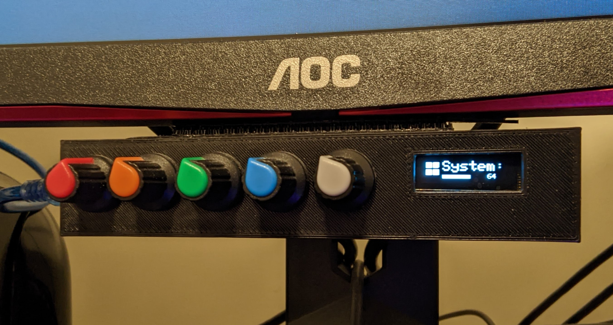

### deej

This fork includes code and models to produce a 5 pot Deej that uses a ssd1306 oled over i2c. The oled will update with the volume number and percentage bar, along with the text and icon of the slider being modified. The screen will sleep after a few seconds.

## building new icons

You can go here [http://javl.github.io/image2cpp/](http://javl.github.io/image2cpp/) to make new icons in the PROGMEM format required. Simply upload an image (I use 18x18 black and white images), scroll to the bottom, and click Generate code, and use the newly generated PROGMEM block in the arduino sketch.